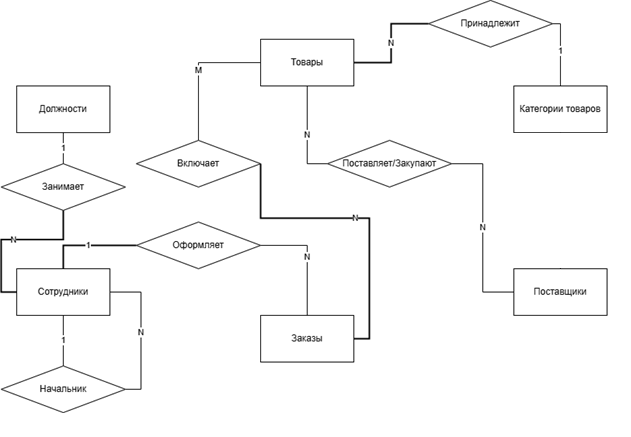
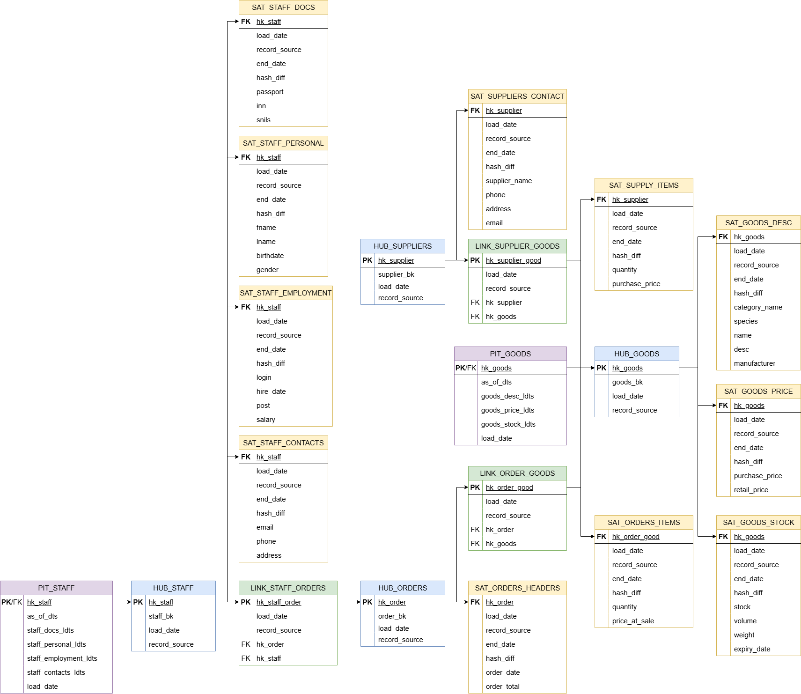

# Petshop Database

Relational database design for a pet shop management system.

The project was developed as part of a university database course.

For full documentation (in Russian), including domain analysis and database design,
see the [docs folder](docs/).

## Features

- product inventory management
- order tracking
- supplier management
- employee roles and permissions
- automated stock updates

## Technologies

SQL  
PostgreSQL  

## Database structure

Main entities:

- Goods
- Categories
- Suppliers
- Orders
- Staff
- Posts
- Order_Items
- Supply_Items

## Additional functionality

The database includes:

- triggers for stock validation
- views for analytics
- role-based access control
- indexes for performance

## Repository structure

schema.sql - database schema  
views.sql - analytical views  
triggers.sql - business logic triggers  
roles.sql - roles and permissions  
indexes.sql - database indexes
docs/ - other documentation and analysis

## ER Diagram

## Relational DB Scheme

## Data Vault Concept

The diagram shows a possible Data Vault modeling approach derived from the operational relational schema of the Petshop database.

