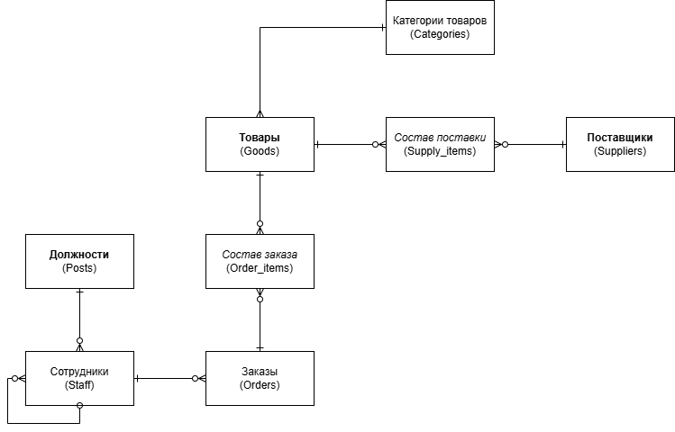

# Логическое проектирование РБД

## Реляционная схема базы данных

---

# Составление реляционных отношений

## Таблица 2. Схема отношений **ТОВАРЫ (Goods)**

| Содержание поля | Имя поля | Тип, длина | Примечания |
|---|---|---|---|
| Код товара | G_id | N(4) | PK, NOT NULL |
| Наименование | G_name | V(100) | NOT NULL |
| Описание | G_desc | V(255) | NULLABLE |
| Закупочная цена | G_purchase_price | N(10,2) | NOT NULL |
| Розничная цена | G_retail_price | N(10,2) | NOT NULL |
| Остаток на складе | G_stock | N(6) | NOT NULL |
| Объём | G_volume | V(20) | NULLABLE |
| Вес | G_weight | V(20) | NULLABLE |
| Срок годности | G_expiry_date | DATE | NULLABLE |
| Производитель | G_manufacturer | V(50) | NULLABLE |
| Категория | G_category_id | N(4) | FK → CATEGORIES(C_id), NOT NULL |
| Вид животного | G_species | V(50) | NOT NULL |

---

## Таблица 3. Схема отношений **КАТЕГОРИИ ТОВАРОВ (Categories)**

| Содержание поля | Имя поля | Тип, длина | Примечания |
|---|---|---|---|
| Код категории | C_id | N(4) | PK, NOT NULL |
| Название категории | C_name | V(50) | NOT NULL, UNIQUE |
| Описание категории | C_desc | V(255) | NULLABLE |

---

## Таблица 4. Схема отношений **ПОСТАВЩИКИ (Suppliers)**

| Содержание поля | Имя поля | Тип, длина | Примечания |
|---|---|---|---|
| Код поставщика | S_id | N(4) | PK, NOT NULL |
| Наименование | S_name | V(100) | NOT NULL |
| Телефон | S_phone | V(20) | NULLABLE |
| Адрес | S_address | V(255) | NULLABLE |
| E-mail | S_email | V(100) | NULLABLE |

---

## Таблица 5. Схема отношений **ЗАКАЗЫ (Orders)**

| Содержание поля | Имя поля | Тип, длина | Примечания |
|---|---|---|---|
| Номер заказа | O_id | N(6) | PK, NOT NULL |
| Дата продажи | O_date | DATE | NOT NULL |
| Итоговая сумма | O_total | N(10,2) | NOT NULL |
| Идентификатор сотрудника | O_staffid | N(6) | FK → STAFF(ST_id), NOT NULL |
| Код товара | O_goodsid | N(4) | FK → GOODS(G_id), NOT NULL |

---

## Таблица 6. Схема отношений **СОТРУДНИКИ (Staff)**

| Содержание поля | Имя поля | Тип, длина | Примечания |
|---|---|---|---|
| Код сотрудника | ST_id | N(6) | PK, NOT NULL |
| Фамилия | ST_fname | V(50) | NOT NULL |
| Имя, отчество | ST_lname | V(50) | NOT NULL |
| Паспортные данные | ST_passport | C(10) | NOT NULL, UNIQUE |
| Дата рождения | ST_birthdate | DATE | NOT NULL |
| Пол | ST_gender | C(1) | NOT NULL (M/F) |
| ИНН | ST_inn | C(12) | NULLABLE, UNIQUE |
| СНИЛС | ST_snils | C(11) | NULLABLE, UNIQUE |
| Логин пользователя | ST_login | V(50) | UNIQUE, NOT NULL |
| Дата принятия на работу | ST_hire_date | DATE | NOT NULL |
| Должность | ST_post | V(50) | FK → POSTS(P_name), NOT NULL |

---

## Таблица 7. Схема отношений **ДОЛЖНОСТИ (Posts)**

| Содержание поля | Имя поля | Тип, длина | Примечания |
|---|---|---|---|
| Код должности | P_id | N(4) | PK, NOT NULL |
| Название должности | P_name | V(50) | NOT NULL, UNIQUE |
| Оклад | P_salary | N(10,2) | NOT NULL |
| Описание должности | P_desc | V(255) | NULLABLE |

---

## Таблица 8. Схема отношений **СОСТАВ ЗАКАЗА (Order_Items)**

| Содержание поля | Имя поля | Тип, длина | Примечания |
|---|---|---|---|
| Номер заказа | OI_order_id | N(6) | PK (составной), FK → ORDERS(O_id), NOT NULL |
| Код товара | OI_good_id | N(4) | PK (составной), FK → GOODS(G_id), NOT NULL |
| Количество | OI_quantity | N(6) | NOT NULL |
| Цена продажи | OI_price_at_sale | N(10,2) | NOT NULL |

---

## Таблица 9. Схема отношений **СОСТАВ ПОСТАВКИ (Supply_Items)**

| Содержание поля | Имя поля | Тип, длина | Примечания |
|---|---|---|---|
| Номер поставки | SI_id | N(6) | PK |
| Код поставщика | SI_s_id | N(4) | FK → SUPPLIERS(S_id) |
| Код товара | SI_g_id | N(4) | FK → GOODS(G_id) |
| Количество | SI_quantity | N(6) | NOT NULL |
| Цена закупки | SI_price_at_sale | N(10,2) | NOT NULL |

---

# Нормализация отношений

## 1НФ

Для **SUPPLY_ITEMS** изменён первичный ключ на составной:

**SI_id + SI_g_id**

Причина: один номер поставки может содержать несколько товаров, иначе возможны дубликаты.

---

## 2НФ

Изменения:

- Удалено поле **O_goodsid** из таблицы **ORDERS**

Причина: частичная зависимость от первичного ключа.

- В **STAFF** заменена ссылка  

ST_post → POSTS(P_name)  

на  

ST_post_id → POSTS(P_id)

Причина: устранение зависимости от неключевого атрибута.

---

## 3НФ

Изменений не требуется.

Все атрибуты зависят только от первичных ключей таблиц.

---

## 4НФ

В таблице **SUPPLY_ITEMS** обнаружено нарушение:

поле **SI_s_id** зависит только от части ключа (**SI_id**).

Корректное решение — выделить таблицу **SUPPLIES**,  
но это запрещено условием задания, поэтому структура оставлена без изменений.

---

# Дополнительные ограничения целостности

1. Дата окончания не раньше даты начала  
2. Количество на складе ≥ 0  
3. Сотрудник младше 18 лет не может быть принят  
4. Оклад ≥ МРОТ

---

## Права доступа пользователей

### Группы пользователей

**Владелец зоомагазина**

Полные права на ключевые таблицы: сотрудники, товары, заказы.

**Менеджер магазина**

Может управлять товарами, заказами и поставщиками, но не может удалять данные о сотрудниках и должностях.

**Сотрудники**

Могут читать данные о товарах и категориях и добавлять записи в заказы.

---

### Таблица 18. Права доступа

| Таблицы | Владелец | Менеджер | Сотрудники |
|---|---|---|---|
| Товары | SUID | SUI | S |
| Категории товаров | SUID | SUI | S |
| Поставщики | SUID | SU | — |
| Заказы | SUID | SUI | SI |
| Состав заказа | SUID | SUI | SI |
| Сотрудники | SUID | S | — |
| Должности | SUID | S | — |
| Состав поставки | SUID | SUI | — |

\* Таблица **Сотрудники** содержит конфиденциальные данные.

---

### Таблица 19. Обозначения прав

| Обозначение | Значение |
|---|---|
| I | Insert |
| S | Select |
| U | Update |
| D | Delete |